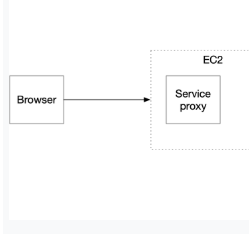
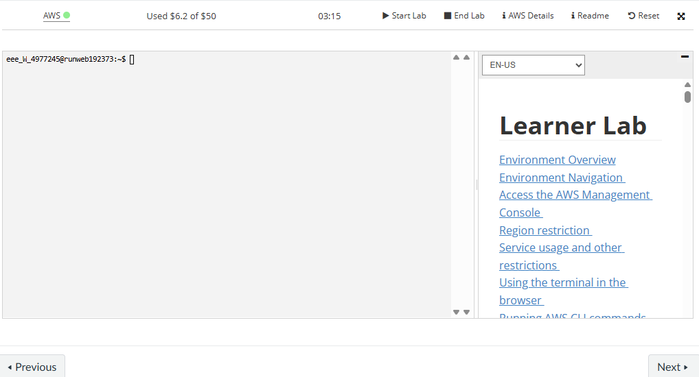
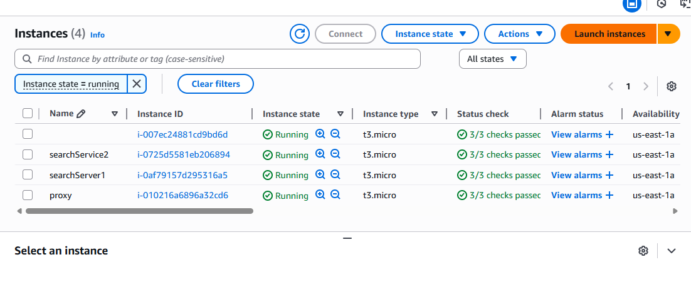
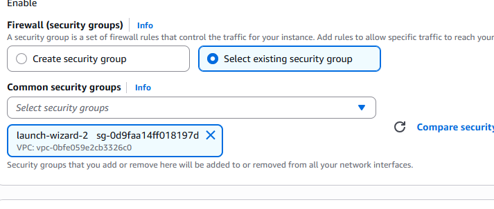
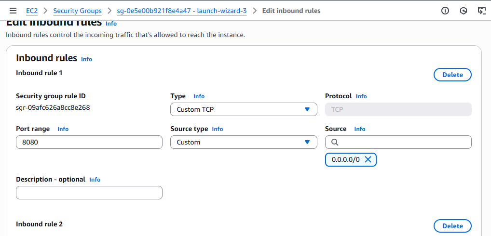
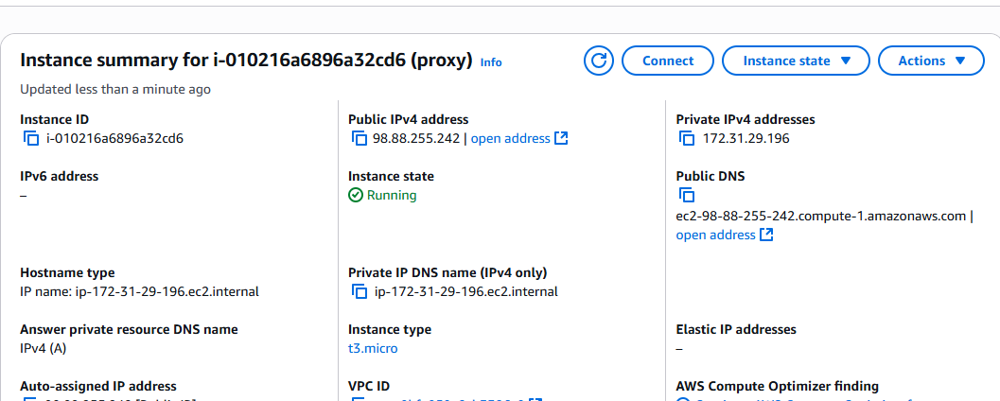
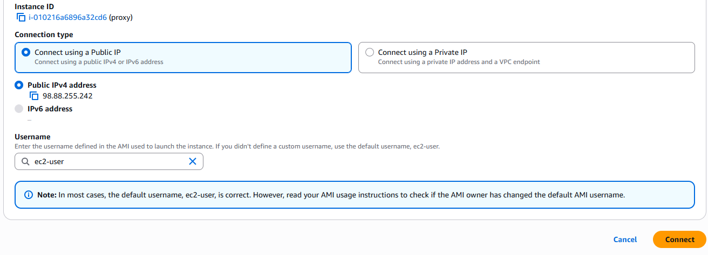
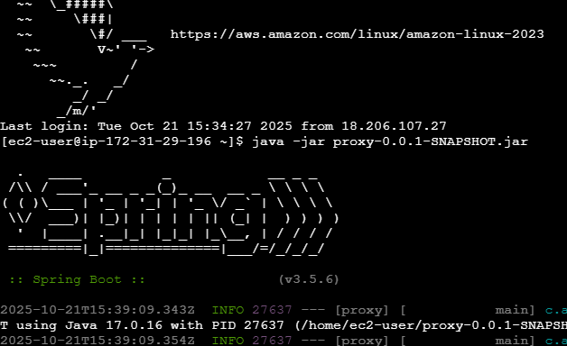
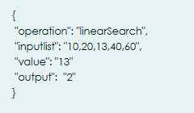

# parcialSegundoCorte

## autor Santiago Coronado Pinzon 

# Proxy rendirector

este proyecto es mi parcial de segundo corte de arep
consta de una arquitectura desplegada de aws y un proxy 
que redirecciona las peticiones a dos instansias de los servicios
este proxy funciona como balanceador de cargas basico.

ya hablando de el reto en java esto en un servidor, que tiene como objetivo 
recibir una lista y hacer la busqueda de un valor dentro de ella.
para ello se pidio implementaer la busqueda lineal y una busqueda binaria

## busqueda lineal

La búsqueda lineal, también conocida como búsqueda secuencial, es un método simple y directo para encontrar un elemento en un conjunto de datos. Funciona de la siguiente manera:

Inicio: Comenzar desde el primer elemento del conjunto de datos.

Comparación: Comparar cada elemento con el valor buscado.

Resultado:


Si el elemento actual es igual al valor buscado, se retorna la posición de ese elemento, indicando así que el elemento ha sido encontrado.
Si el elemento actual no es igual al valor buscado, se pasa al siguiente elemento.
Finalización: Este proceso continúa hasta que se encuentra el elemento o se ha recorrido todo el conjunto de datos.
No encontrado: Si se llega al final del conjunto sin encontrar el valor, se indica que el elemento no está presente.
La búsqueda lineal no requiere que los datos estén ordenados y es efectiva para conjuntos de datos pequeños, pero su eficiencia disminuye a medida que el tamaño del conjunto de datos aumenta, ya que en el peor caso, se deben comparar todos los elementos.

## busqueda binaria

Búsqueda Binaria
La búsqueda binaria es un método más eficiente que la búsqueda lineal, pero requiere que el conjunto de datos esté ordenado previamente. Su proceso se describe de la siguiente manera:

Inicio: Determinar los índices de inicio y fin del conjunto de datos, que inicialmente son el primer y último elemento, respectivamente.

División: Calcular el índice medio del conjunto de datos actual y comparar el elemento en esta posición con el valor buscado.

Comparación:

Si el elemento medio es igual al valor buscado, se retorna la posición de este elemento, indicando que se ha encontrado.
Si el elemento medio es mayor que el valor buscado, se descarta la mitad superior del conjunto y se repite el proceso con la mitad inferior.
Si el elemento medio es menor que el valor buscado, se descarta la mitad inferior del conjunto y se repite el proceso con la mitad superior.
Iteración: El proceso se repite, reduciendo a la mitad el tamaño del conjunto de datos en cada paso.
Finalización: Este proceso continúa hasta que se encuentra el valor o el subconjunto se reduce a cero.
La búsqueda binaria es muy eficiente en conjuntos de datos grandes, ya que reduce significativamente el número de comparaciones necesarias en comparación con la búsqueda lineal, logrando una complejidad temporal de O(log n), donde n es el número de elementos en el conjunto de datos.


# arquitectura

el cliente hace la peticion a el proxy 



el proxy con el algoritmo hace redireccion a las instacias


## ¿como hacer uso de este proyecto?

- primero debes tener instalado java y maven como requisitos

-debes clonar el repositorio en tu maquina local.

```bash
    git clone 
```

- debes en la raiz del proyecto ejecutar el siguiente comando para empaquetar

```bash
    mvn package
```
- se te va a generar la carpeta Target, alli estara el jar.

- despues debes ejecutar el comando para poner a correr la aplicacion.

```bash
    mvn spring-boot:run
```


## pasos para desplegar en aws
- primero ponemos la consola de aws a correr 


- creamos una instacia de EC2



- creamos un par de laves 


- creamos o asignamos un grupo de seguridad



- una vez creadas las instncias en el grupo de seguridad se debe abrir el puerto que esta corriendo la aplicacion java


- nos conectamos a la instacia por la interfaz grafica






- una vez dentro debemos instalar maven y java para poder correr el programa.

```bash
    sudo dnf install maven -y
```


-una vez instalados estos dos paquetes, debemos pasar el jar a el EC2 y ponerlo a correr.

```bash
    java -jar proxy-0.0.1-SNAPSHOT.jar
```

### asi tenemos funcionando nuestra app de spring, se repitio el mismo proceso para todas las insatcias.




## Funcionamento y requisitos

Detalles adicionales de la arquitectura y del API
Implemente los servicios para responder al método de solicitud HTTP GET. Deben usar el nombre de la función especificado. Los parámetros deben ser pasados en variables de query con nombres "list" y "value".

El proxy debe delegar el llamado a los servicios de backend. El proxy y los servicios se deben implementar en Java usando Spring.

- Salida. El formato de la salida y la respuesta debe ser un JSON con el siguiente formato.

ejemplo:



- los datos se reciben atravez de query en la url 


- Cliente asíncrono que corra en el browser escrito en HTML5 y JS (No use librerías, solo html JS básico).
- El cliente NO COMPUTA LA SECUENCIA DIRECTAMENTE, sino que la delega a un servicio REST corriendo en AWS.
- El servicio REST puede ser GET o POST.
- Se debe construir la aplicación usando Spring Boot y desplegarla en un contenedor corriendo en AWS.
- Cree un solo repositorio en github para toda la aplicación
- Use los mejores estándares de diseño, arquitectura y programación.

## capturas de funcionamiento 

-binarySearch


-linearSearch


## instacias corriendo 

